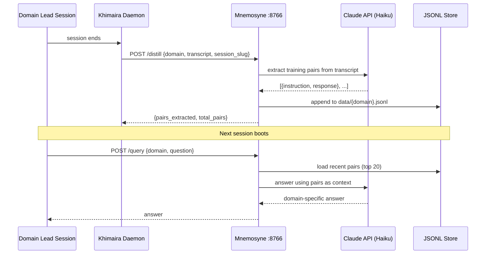
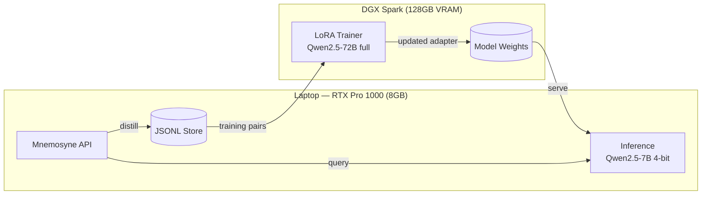
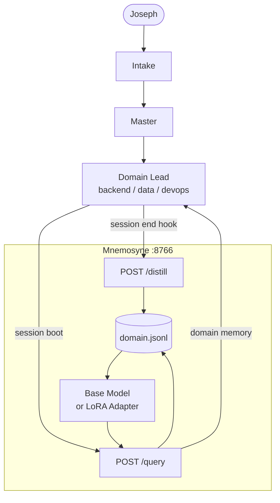

# ai-lab

Local AI infrastructure for khimaira. Runs as sidecars alongside the khimaira daemon.

## Services

| Service | Port | Purpose |
|---|---|---|
| mnemosyne | 8766 | Persistent domain memory — distill + query + LoRA fine-tune |

## Models

Shared model weights live in `models/`. Downloaded once, used by all services.

| Model | Size | GPU tier |
|---|---|---|
| Qwen2.5-7B-Instruct (4-bit) | ~4.5GB VRAM | Laptop RTX Pro 1000 (8GB) |
| Qwen2.5-72B-Instruct (full) | ~128GB VRAM | DGX Spark (128GB) |

---

## Architecture

### Phase 1 — Distill + Query (no GPU required)



### Phase 2 — LoRA Fine-Tune (GPU)



### Khimaira Integration



---

## Setup

```bash
cd mnemosyne
uv venv --python 3.12
uv pip install -e .
mnemosyne serve          # starts at 127.0.0.1:8766
```

For Phase 2 (LoRA fine-tuning):

```bash
uv pip install torch transformers peft bitsandbytes accelerate datasets
```

## API

| Method | Path | Description |
|---|---|---|
| GET | `/health` | Service health + domain list |
| GET | `/domains` | Training pair counts per domain |
| POST | `/query` | Answer a domain memory question |
| POST | `/distill` | Extract training pairs from a session transcript |
